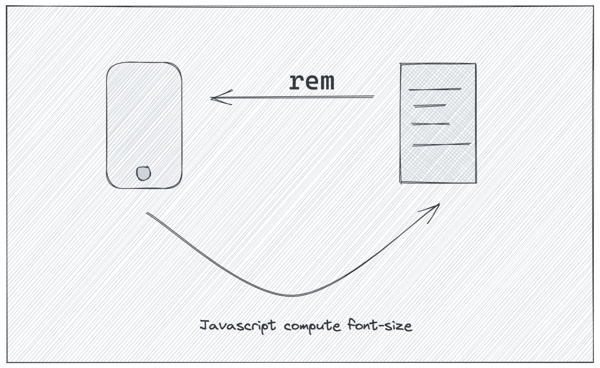

如今的前端开发可真是越来越难了，不仅前端技术变化快，能访问页面的终端也越来越多了。以前大部分是通过PC访问，后面是出现智能手机后，平板，甚至手表，各个终端的屏幕尺寸千差万别。以iPhone为例，最早都是3.5英寸的，后面4.7英寸，现如今都有8种不同尺寸，具体可以看[设备屏幕尺寸大全](https://uiiiuiii.com/screen/)，开发一个页面就不得不考虑各种屏幕的展示效果，那我们又如何来适配不同屏幕的展示效果呢，总不可能不通尺寸开发一套样式吧。

<!-- more -->

## 基于JavaScript 和 rem 的响应式设计
响应式设计最好可以追溯到淘宝/网易的h5页面设计，通过rem方案来实现。

其原理可以简单理解为：


其实现可以参考[lib-flexble](https://github.com/amfe/lib-flexible)页面加载完成时，会通过JavaScript获取页面的`clientWidht`，然后设置html的`font-size`。 例如对于iPhone6而言，其宽度为375px, html标签的`font-size`会被设置为 `37.5px`。需要使用宽度的地方使用 `rem` 替代 `px`。 在iPhone6/7/8中 `1rem = 37.5px`。 当然我们也可以定义计算规则，例如在iPhone6中设置 `1rem = 10px`，可以通过下面规则函数转换：
```JavaScript
function setRem () {
  const size = document.documentElement.clientWidth / 37.5;
  document.documentElement.style.fontSize = size + 'px';
}
setRem();
window.addEventListener('resize', setRem);
```

使用库还会检测是否支持 `0.5px` 这种设置 1px border的方案，如果支持会添加一个`hairlines` 的类，在需要使用border的情况下，就可以使用:
```css
div {
  border: 1px solid #ddd;
}
// 适配移动端 1px border
.hairline div {
  border: 0.5px solid #ddd;
}
```
对于不支持的终端，则默认展示为 `1px`。这种方式对于视觉要求不高的场景是挺实用的。

该方案主要确定是需要通过JavaScript来动态计算fontSize，虽然简单，但还是有些冗余。

## 基于 vw 和 rem 的响应式设计
使用JavaScript目的是根据屏幕宽度计算html的fontSize大小，在CSS中有`calc（）`函数支持动态计算数值，而 `vw`单位刚好可以获取到页面的宽度`1vw = document.documentElement.clientWidth / 100`。因此当我们需要实现iPhone6 上面的 `1rem = 100px`，也就是设置fontSize为`100px`时，可以通过CSS实现：
```CSS
html {
  font-size: calc(100vw / 37.5);
}
```

如果需要适配横屏，那就需要使用一下 `vmin`来替代 `vw`, `vmin = Math.min(vw, vh)`使得大小是合适的。

如果需要使用限定某一个宽度范围，可以通过媒体查询设置不同的规则，例如在超过 1000px 的屏幕，我们希望字体随着屏幕增大，但减缓增长
```CSS

html {
  font-size: calc(100vw / 37.5);
}

@media screen and (min-width: 1000px) {
  // 每增加100px时，fontSize增加 1 px
  font-size: calc(26px + (100vw - 1000px) / 100);
}
```
通过使用media查询，可以任意定制fontSize的尺寸，结合rem就可以实现响应式布局了。

小Tip: 移动端一般html的font-size为16px，如果遇到一些Bug，例如需要兼容某些Safari版本浏览器时，可以通过使用百分比100%来兼容，例如:

```CSS
html {
  // iPhone6屏幕大小为16px， iphoneX 大小为 16.39px
  font-size: calc(100% + (100vw - 375px) / 100);
}
```

