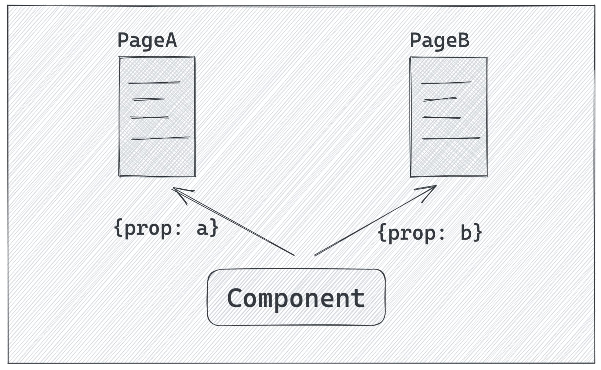

最近遇到一个很无趣的问题，发现问题到解决问题耗费了不少精力。问题是这个样子的，在一个SPA的项目中，有两个页面复用了同一个下拉选择组件，传递给组件的属性是不一样的，期望获取的数据字段字段不一样：


<!-- more -->

但是切换页面是发现两者行为总是一致，要么A页面符合预期B页面不符合，要么B页面符合预期但是A页面又不符合预期了。但不符合预期时，刷新一下页面又好使了。一开始还以为是环境问题，页面加载的JS资源有问题。先检查了一遍加载资源和发布的静态资源都是一样的，然后就很懵逼了。。。

## 排查问题
排查问题我常用的有两种方式：
1. 通过现象找原因：也就是最常用使用的debug模式，通过二分法缩小影响访问，一步一步趋近问题的根因，这种方式比较适合不熟悉的项目，或者一些诡异的兼容性问题。
2. 通过代码印证猜想：出现问题先提出问题原因的猜想，然后通过代码去一一印证代码，如果踩坑够多，这种方式解决问题效率会高很多。
随着工作年限的增加，经验也越发丰富，所以一般都是先猜想，然后验证失败后再使用debug模式来寻找问题的原因。

针对该问题在第一个猜想是否环境问题，被验证不是真正原因后，就放弃猜想了，还是debug了一下代码。debug代码有很多种方式，例如添加执行日志，或者单步调试，或者缩减代码写demo等。 通过 debug 代码发现原因是这个组件通过工厂函数创建的，然后依赖另外的一个组件，同时会缓存工厂函数创建的结果，如果命中了就直接返回，形式为：
```javascript
function ComponentB (props) {
  ....
}
let cache;
function factory(props) {
  if (!cache) {
    cache = ComponentB(Object.assign({xx: xx}, props));
  }
  return cache;
}
// 页面依赖的组件
const ComponentA = factory({props: x})
```
原因可能看出来了，我们传入的属性并不会影响到缓存，也就是说A页面和B页面其实共用的同一个缓存结果，后来者没法通过props影响到组件的表现了。

这种方式看起来抽象出来看起来是不是有点蠢，但有时候就是这么迫不得已，为了自认为所谓的性能，就加入一些缓存。虽然但是还是避免不了添加缓存，因为不写点高级的代码，怎么体现自己的能力呢？既然需要加入，那如何避免踩坑？

## 缓存的设计
首先需要明确是缓存是为了某一个具体场景的问题，需要有限制范围，不然缓存就没有存在的意义了。没有边界，职责就不清晰，这就埋下了隐患，其实苦逼程序的员的日常也是这样，没有边界的事情狗都不想理，只有泥淖，越陷越深。这明显是一个坑，所以设计缓存，先定义场景。明确使用场景后，需要分析场景的变量。好比一个纯函数，函数输出只依赖于输入，是需要可预测的。缓存也是一样，是否命中缓存应该也是可预测的。

可预测性意味着当我们需要缓存某一个场景相关的数据时，需要考虑到该场景下面的所有输入的变量。上述案例中缓存其实就是没有考虑不同页面的属性不一样，导致出现隐藏较深的Bug。对于前端页面而言，当我们需要缓存数据时，一般会有两种情况：
1. 无输入类型缓存，例如浏览器环境的判断，这种情况一般用一个JavaScript的变量来保存，在首次使用时计算并赋值，后续需要就可以命中缓存；
2. 有输入类型缓存，例如接口数据缓存，计算结果缓存，都是有前置依赖，这种就需要特别的小心了，接下来会重点讲述。

### 缓存的生命周期管理
设计缓存时，首要是确定缓存的生命周期，什么时候产生，什么时候销毁，这其实就决定了使用哪种存储方式： 内存、sessionStorage/localStorage、indexDB等。一般数据计算结果，组件等会使用内存缓存，在第一次执行后进行缓存，后续可直接使用提升页面的体验，内存的好处是不仅可以存储数据，还可以完整保留JavaScript的对象引用关系等，是最常用的方式了，像React中的 useMemo, memo, useCallback等都是基于内存缓存的。 而 sessionStorage/localStorge 会用于放一些特定场景的数据，例如页面埋点需要一个uuid来统计pv/uv，如果是非强制登录网站，一般会生成一个随机字符串存储在localStorage中，当然还有持久化页面的一些状态，例如数据筛选项这种，以提供刷新前后一致性的交互。如果使用localStorage，还需要考虑存储大小的限制，浏览器的限制大概为4MB，所以需要有一个清空的机制，避免出现写满的情况。IndexDB接触较少，就不展开了。

### 缓存的key/value设计
缓存大多数情况下都是key/value结构，针对缓存的key首要原则的就是唯一性，这个应该比较好理解，我们都不希望无缘无故就命中不相关的缓存。例如我们针对A页面缓存了些数据（例如是否访问过的标识），访问B页面时也能命中这个缓存，就会出现一些异常。这个唯一性一般可以有以下几种方式保证：
1. 数据id，如果是后端数据，一般都会有个对应的id，例如列表页面，需要知道哪些访问过，显示不同的样式，就可以使用这些id做为key。
2. 时间戳方式，例如需要保存页面状态，在页面回退时恢复，即可以在url上面添加一个时间戳，然后以这个时间戳做为缓存的key，这样可以有效的避免新进入和回退场景。
3. 序列化变量，序列化方式可以是JSON.stringify或者URLEncode的方式，或者自己写一个序列化函数，这种一般针对有多个变量，需要缓存数据有用，当然如果是是JavaScript内存缓存，可以使用 Map 就可以了，还不用这么费劲。
4. MD5字符串方式，这种方式适合于文件或者大段文本情况，例如静态的缓存的判断会使用的ETag标签就是MD5字符串，当然前端页面用得相对较少，一般是后端缓存可能会涉及了。

针对value的设计，主要是精简和完整性，精简是为了省空间，完整性看似和精简冲突，这其实是一个取舍的过程，在足够完整的情况下做精简的操作，也就是至少保证可用，例如缓存文章列表中文章是否被点击过，可以设计为：
```JavaScript
// 实用性设计
{
  articleId: true
}

// 前瞻性设计
{
  articleId: [{
    type: 'visited',
    value: true,
  }]
}
```
我是推崇实用性设计，这种就比较精简，同时也满足现阶段的诉求，这就足够了，至于扩展性不强，以后的事情再说了，说不定就被裁员了，瞎操心那么多干啥。

## 总结
缓存数据很多情况下面可能不是不必要，其实如果不是性能要求高或者页面确实非常慢的，基本还是不太需要的。如果真有必要缓存，就需要考虑缓存的唯一性、生命周期管理等。写Bug不容易，希望大家少写代码多挣钱。